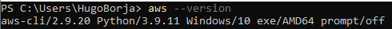

# Week 0 — Billing and Architecture

## Required assigments

1. [Configure AWS CLI](#configure-aws-cli)
2. [Proof of budget created](#budget-created)
3. [Proof of bubilling alert created](#billing-alert)
4. [Conceptual diagram for Cruddur APP (in my case: "blogcrudster" as per my own domain)](#conceptual-diagram)
5. [Architecte diagram for Cruddur APP](#architecture-diagram)
6. [Annexes](#annexes)

#

### Configure AWS CLI

a. Showing the version of my AWS CLI

b. Configure my CLI access credentials

c. Checking that the configuration was successful

#

### Budget created

#

### Billing alert

#

## Architecture Cruddur (blogcrudster) APP

**Note:** I had to use "Draw.io" as my drawing tool, because Lucidchart only gave me a very limited amount of "free shapes" [(see attached image).](#annexes)

Link to external asset: [Conceptual diagram](https://drive.google.com/drive/folders/1muLo_8e-vkBY74dYLDbtETihWIfVLB3v)

### Conceptual diagram

### Architecture diagram

#

### Annexes

